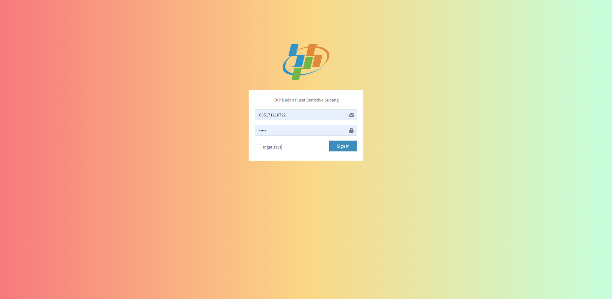

# Aplikasi Pegawai

Aplikasi ini adalah aplikasi yang dibuat sebagai prasyarat tugas magang di [kantor BPS Kab. Subang](https://maps.app.goo.gl/Jad4ciVZdD5p281q8).  

## Anggota
Mahasiswa praktik kerja lapangan di kantor BPS terdiri dari 5 anggota : 
1.  [Allaya Aqila](https://github.com/Allayaans)
2.  [Dinar Nursifa](https://github.com/Dinarnursifa)
3.  [Syifa Nadia](https://github.com/nadiasyifa82)
4.  [Risma Aprillia](https://github.com/rismaapr)
5.  Indah Y

